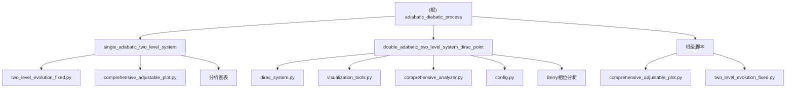

# adiabatic_diabatic_process - AI 上下文文档

**变更记录 (Changelog):**
- 2025-11-15 15:30:00: 新增 double_adabatic_two_level_system_dirac_point 模块，实现二维狄拉克点Berry相位绕圈积分
- 2025-11-15 14:15:42: 初始化项目 AI 上下文，完成全仓清点和模块分析

## 项目愿景

本仓库致力于深入研究各种绝热-非绝热过程（adiabatic-diabatic processes），通过数值模拟和理论分析来理解量子系统在不同条件下的动力学行为。项目聚焦于量子物理中的核心现象，包括绝热定理、Landau-Zener跃迁、Berry相位等基础理论及其在现代量子技术中的应用。

## 架构总览

### 模块结构图



## 模块索引

| 模块路径 | 语言 | 主要功能 | 状态 | 入口文件 |
|---------|------|----------|------|----------|
| `single_adabatic_two_level_system/` | Python | 单绝热变量二能级系统研究 | ✅ 已实现 | `two_level_evolution_fixed.py` |
| `double_adabatic_two_level_system_dirac_point/` | Python | 二维狄拉克点Berry相位绕圈积分 | ✅ 已实现 | `comprehensive_analyzer.py` |
| 根级脚本 | Python | 便捷运行脚本 | ✅ 已实现 | `comprehensive_adjustable_plot.py` |

## 运行与开发

### 环境要求
- Python >= 3.7
- numpy >= 1.20.0
- matplotlib >= 3.3.0
- scipy >= 1.6.0

### 快速开始
```bash
# 运行单绝热变量系统分析
cd single_adabatic_two_level_system/
python comprehensive_adjustable_plot.py

# 运行二维狄拉克点Berry相位分析
cd double_adabatic_two_level_system_dirac_point/
python comprehensive_analyzer.py

# 或直接运行根级脚本
python comprehensive_adjustable_plot.py
```

### 开发工作流
1. 使用 `TwoLevelSystem` 类进行哈密顿量建模
2. 通过 `evolve()` 方法进行时间演化计算
3. 利用 `create_comprehensive_plot()` 生成可视化分析
4. 检查绝热参数 `γ(t) ≪ 1` 验证绝热条件

## 测试策略

- **数值验证**: 与Landau-Zener公式对比验证跃迁概率
- **绝热条件检查**: 监测绝热参数 `γ(t)` 是否满足 `≪ 1` 条件
- **相位连续性**: 确保Berry相位计算的数值稳定性
- **收敛性测试**: 验证时间步长和积分精度的影响

## 编码规范

- 使用中文注释和英文变量名
- 遵循 PEP 8 代码风格
- 类型注解使用 `typing` 模块
- 物理常量使用自然单位制 (ℏ=1)
- 函数和类包含详细的docstring

## AI 使用指引

### 核心概念理解
- **绝热定理**: 哈密顿量缓慢变化时系统保持瞬时本征态
- **Landau-Zener模型**: 能级避免交叉的非绝热跃迁概率 `P_LZ = exp(-2πV²/α)`
- **Berry相位**: 参数空间演化获得的几何相位
- **狄拉克点**: 二维能带中的线性色散点，哈密顿量为 `H(k) = v_F(kxσx + kyσy)`
- **绝热参数**: `γ(t) = |⟨m(t)|∂ₜH(t)|n(t)⟩|/[E_m(t)-E_n(t)]²`

### 代码修改指南
1. 修改哈密顿量时同步更新绝热参数计算
2. 时间演化算法优先使用RK4方法，精度不足时切换SciPy
3. 可视化应包含能级、布居、相位、绝热参数四个关键维度
4. 所有物理量都使用无量纲化表示

### 扩展开发建议
1. 新增模块应继承现有的 `TwoLevelSystem` 或 `DiracSystem` 类设计模式
2. 多能级系统可参考二能级系统的架构
3. 耗散系统需要添加Lindblad主方程支持
4. 优化控制模块应实现STA(Shortcuts to Adiabaticity)算法
5. 二维系统可扩展到椭圆轨迹、8字形轨迹等更复杂的k空间路径
6. 可研究多狄拉克点系统的相互作用效应

---

**项目维护者**: ZCF Workflow
**研究领域**: 量子动力学、绝热定理、几何相位、狄拉克点物理
**当前版本**: 2.0
**最后更新**: 2025-11-15 15:30:00